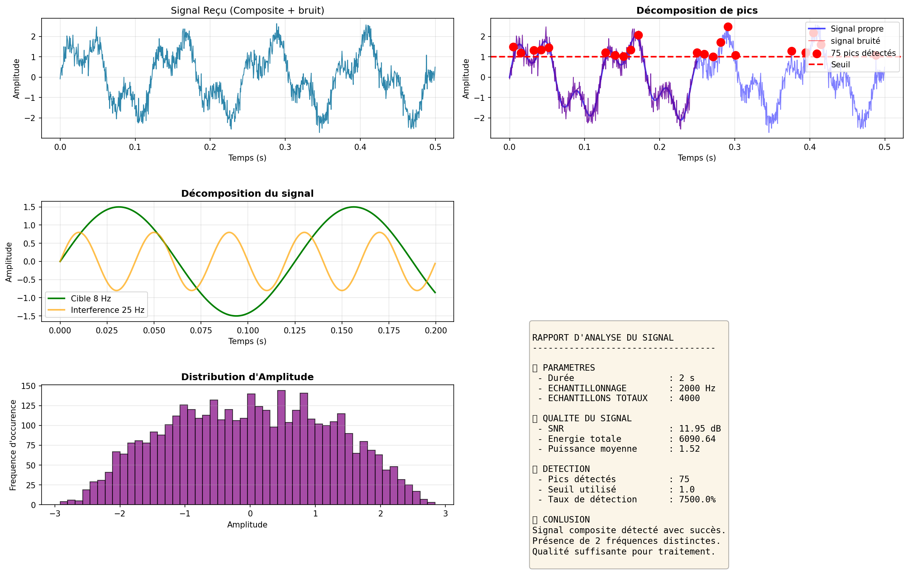

# 🎓 DSP-DATA Engeneering Learning journey
My journey learning DSP and Data Engeneering - Sessions tracking
**Student:** Arafan
**Location:** Russia (Academy - Radio Engeneering) 
**Goal:** Become expert DSP/Data Engeneer 
**Timeline:** 2026 - 2029 (Year 2/5 currently)
**Languages:** French (native) | Russian (technical) | English (learning)

## 📚 Sessions completed

| Session |Topic |      Key skills             |     Date    |
|------------|------|-----------------------------|-------------|
| **Session 1** | Python Basics & First code | Variables, print, datetime | 01/01/2026 |
| **Session 2** | Lists & Loop | Automation, data generation | 02/01/2026 | 
| **Session 3** | Functions & DSP Library | Reusable tools, rader simulation | 04/01/2026 |
| **Session 4** | NumPy and visualization | Arrays, vectorization, matplotlib, signal composition | 07/01/2026 |
| **Session 5** | Advenced Signals | FFT, frequency analysis |
---

## 🛠️ Projects Built

### 1. ***DSP Library v1.0** (Session 3)
Pure Python signal processing functions:
- Signal averanging, power calculation
- Normalization, peak detection
- SNR composite
- **Tech:** Python, math module

### 2. **Radar Echo Simulator** Session 3)
Electromagnetic wave propagation model:
- Distance-based attenuation (inverse square law)
- Time-of-flight calculation
- Detection threshold logic
- **Applications:** Automative radar

### 3. **DSP Library v2.0 - NumPy Edition** (Session 4)
Professional-grade signal processing library:
- 'generer_signal_sinusoidal()' - Parametric signal generation
- 'ajouter_bruit()' - Controlled noise injection with SNR target
- 'calculer_snr()' - Quality measurement
- 'detecter_pics()' - Threshold-based peak detection
- 'puissance_signal()' - Average power
- **Performance:** 100x faster than pure Python
- **Tech:** NumPy, vectorized operations

### 4. **Multi-Frequency Signal Analyzer** (Session 4) ⭐
Complete analysis system with visualization:
**Feactures:**
- Composite signal generation (target + interference)
- Realistic noise addition (configurable  SNR)
- Peak detection with distance filtering
- 6-panel professional visualization:
  - Full signal display
  - Clean vs noise comparison
  - Frequency decompositon
  - Peak detection overlay
  - Amplitude  histogram
  - Automated analysis report

 **Metrics computed:**
 - Signal-to-Noise Ratio (dB)
 - Tatal energy and average power
 - Peak detection rate
 - Amplitude distribution

**Output:** Hight-resolution (150 DPI) analysis report

**Applications:**
- 🎖️
- 💼 Civil: RF interference detection, telecommunications QoS analysis, IoT  sensor validation

**Tech Stack:** NumPy, Matplotlib, custom DSP library v2.0

## 📊 Visualizations
### Signal Analysis Exemple

*Multi-frequency signal analysis showing target detection in noisy environment (SNR ≈ 12dB)*

---

Bulding foundational DSP/Data 

**Languages:** Python, NymPy, SciPy (learning)
**Specialisation:** Signal processing, Telecom Data analysis
